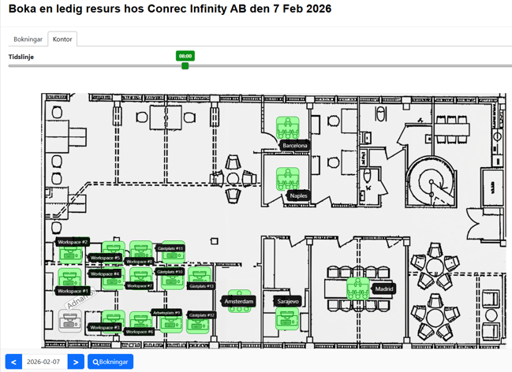

# Office Map Booking

Prototyp for visuell bokning av arbetsplatser. Istallet for att valja fran en lista klickar anvandaren direkt pa en kontorsplanritning for att boka rum och platser.

## Live demo

**https://cola500.github.io/office-map-booking/**



## Hur det fungerar

- En planritning visas som bakgrund
- Arbetsplatser markeras som klickbara hotspots ovanpa bilden
- Gron = ledig, rod = upptagen
- Hover visar namn och status som tooltip
- Klick oppnar en bokningslank

## Implementationer

Projektet innehaller tva versioner:

| Version | Plats | Beskrivning |
|---------|-------|-------------|
| Standalone HTML | `office-map.html` | Enkel prototyp utan byggsystem, vanilla JS |
| React-app | `app/` | Komponentbaserad version med TypeScript |

## Kom igang

### HTML-prototypen

Oppna `office-map.html` direkt i webblasaren.

### React-appen

```bash
cd app
npm install
npm run dev
```

Ovriga kommandon:

```bash
npm run build      # TypeScript-check + produktionsbygg
npm run lint       # ESLint
npm run preview    # Forhandsgranska produktionsbygg
```

## Teknikstack

- React 19
- TypeScript 5.9
- Vite 8
- Vanilla CSS (inga ramverk)
